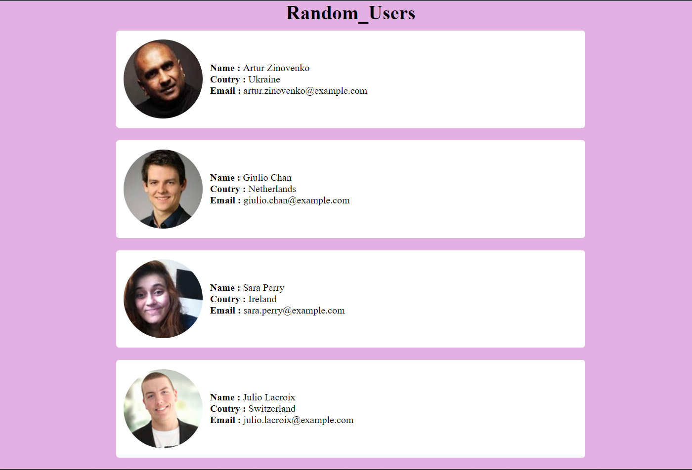

# [Random_Users](https://adityaK87.github.io/Random_Users/)

## 📌 Introduction

This project is fetching Random Users from the <a href="https://randomuser.me/api/?page=1&results=10">API</a> using Async/Await syntax and displaying users to user Component.

## 🚀 View Live Demo


<pre><center><a href="https://adityak87.github.io/Random_Users/"><b>adityak87.github.io/Random_Users</b></a></center></pre>

## 👨‍💻 JavaScript Topics Used

-  ES6 Destructuring
-  Import and Export Syntax
-  Arrow functions
-  Promises
-  Async/await
-  Axios for API Calls

## Tech Stack Used

-  React js
-  React Hooks
-  JavaScript
-  Scss for Styling Component

## 🛠️ Installation Steps

Star and Fork the Repo 🌟 and this will keep us motivated.

1. Clone the repository

```bash
git clone https://github.com/adityaK87/Random_Users
```

2. Change the working directory

```bash
cd Random_Users
```

3. Install dependencies

```bash
npm install
```

4. Run the app

```bash
npm run start
```

## Screenshots

</img>
